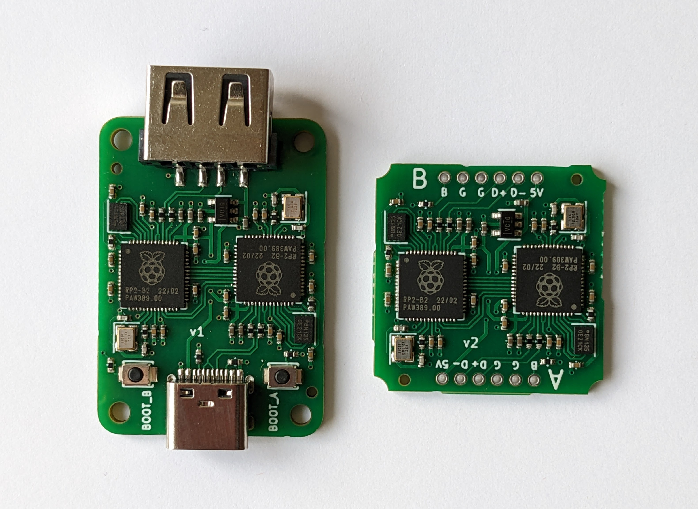

# Custom HID Remapper boards

This document describes how to have custom HID Remapper boards manufactured using the provided design files at a service like JLCPCB. If you'd rather make the device using a Raspberry Pi Pico, see [here](../HARDWARE.md) for details on that option.

There are two versions, imaginatively named v1 and v2. Both of them are equivalent to the dual Pico variant when it comes to functionality and device compatibility.

The main advantage of the v1 version is that it can be made with no soldering, you just order the board, flash the firmware, and have a working device. Files for an optional 3D printable enclosure are also available (it uses M2x8 flat head screws).

The v2 version doesn't have USB connectors and is meant to be built into existing devices like trackballs by soldering the appropriate wires directly to the board.

## How to order the boards

The process of ordering the boards is the same for both versions. You go to JLCPCB's [website](https://jlcpcb.com/), upload the Gerber zip file, enable the "PCB Assembly" option and upload the BOM and CPL files. All the options can be left at their default values. Then click through the rest of the process, making sure that all the components are in stock.

If you want to use some other service than JLCPCB, you will likely need to adapt at least the BOM and CPL files to match their requirements.

## How to flash the firmware

Each board has two RP2040 chips and works the same way as the dual Pico variant described [here](../HARDWARE.md). Therefore you need to flash both chips with appropriate firmware files. The A side (the one that connects to your computer) needs to be flashed with the [remapper\_board\_a.uf2](../firmware/remapper_board_a.uf2) file. The B side (the one you connect your devices to) needs to be flashed with the [remapper\_board\_b.uf2](../firmware/remapper_board_b.uf2) file.

The v1 version of the board has buttons labeled BOOT\_A and BOOT\_B. They work the same way as the BOOTSEL button on a Raspberry Pi Pico (there are two buttons because there are two RP2040 chips). The v2 version doesn't have the buttons, but has equivalent pins broken out. Shorting the appropriate BOOT pin to GND is the same as pressing the button.

Flashing the A side is the same as flashing a Raspberry Pi Pico, you hold the BOOT\_A button (or short the appropriate pins) while connecting the board to a computer, then a drive named "RPI-RP2" should appear and you just copy the UF2 file to that drive.

For flashing the B side there are two options.

Option 1 is to do it the same way as the A side, by connecting it to a computer. To do that on the v1 board, you will need a USB cable with Type-A plugs on both ends. Even though they're not exactly standard, such cables can be bought and you can of course make one yourself. On the v2 board you can just temporarily connect the USB lines from the board to a computer.

(Don't connect both sides to a host at the same time.)

Option 2 is to flash the B side using the A side as a programmer. It is possible because, on our boards, side B's debugging pins SWCLK and SWDIO are connected to side A's GPIO28 and GPIO27 pins. This is a more complex process, but it can be useful if you don't have the non-standard cable or you already have the v2 board wired inside a trackball and want to update the firmware.

I will try to streamline the process in the future, for now it goes as follows:

* Flash A side with [picoprobe.uf2](https://github.com/jfedor2/picoprobe/blob/master/picoprobe.uf2). This will let us use it as a programmer for B side.
* Install OpenOCD (version at least 0.12.0-rc2) on your computer.
* Flash B side with the [remapper\_board\_b.elf](../firmware/remapper_board_b.elf) file using the following command: `openocd -f interface/cmsis-dap.cfg -f target/rp2040.cfg -s tcl -c "adapter speed 10000; program remapper_board_b.elf verify reset exit"` This doesn't require pressing the BOOT button or shorting pins.
* Flash A side with [remapper\_board\_a.uf2](../firmware/remapper_board_a.uf2).

In situations where the BOOT button is not easily accessible, it is possible to put the board in firmware flashing mode through software. If the device is currently flashed with HID Remapper firmware, you can go to the web config tool and press the "Flash firmware" button (there's also an equivalent [command line tool](../config-tool/reset_into_bootsel.py)). If the device is currently flashed with the picoprobe firmware, you can do it with the following command (this only works with [my fork](https://github.com/jfedor2/picoprobe) of picoprobe):

`openocd -f interface/cmsis-dap.cfg -f target/rp2040.cfg -s tcl -c "adapter speed 10000; init; cmsis-dap cmd 80; exit"`
